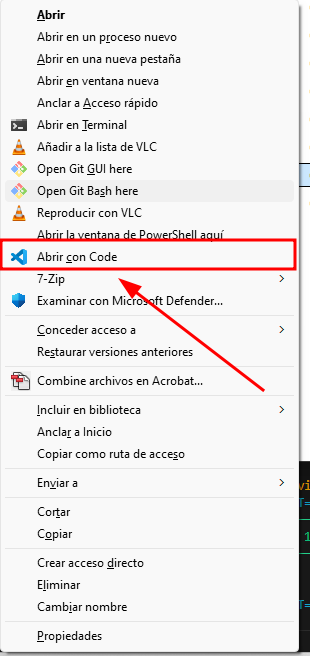
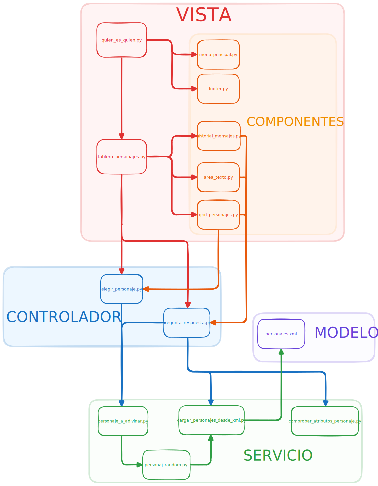
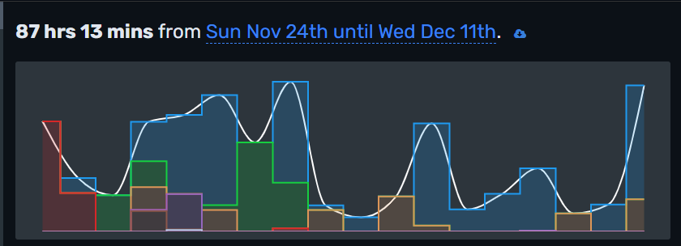
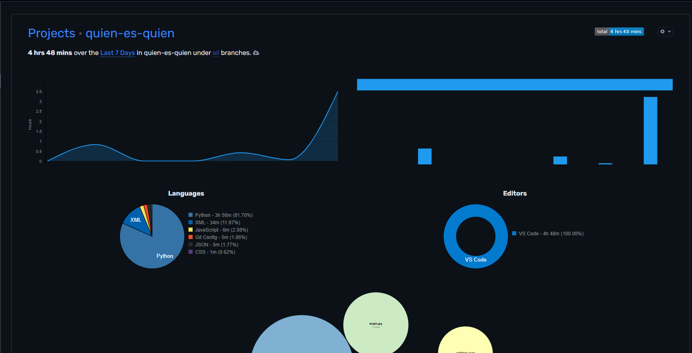
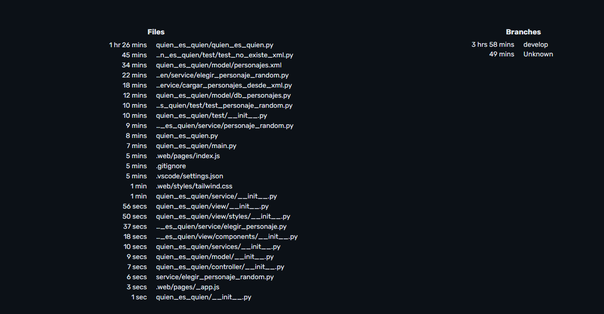
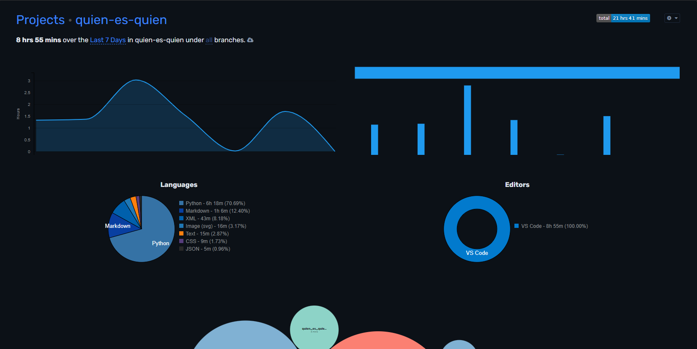
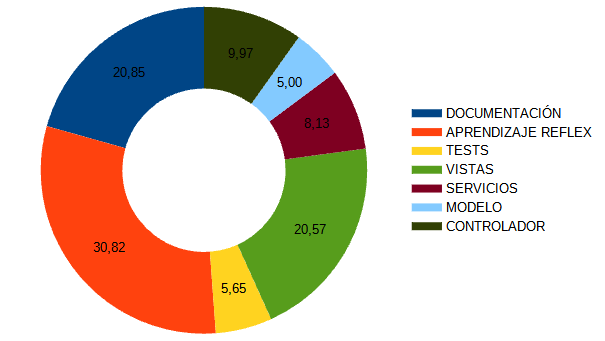

# Tabla de contenido

- [**Introducción**](#introducción)
- [**Manual**](#manual)
    - [**Instalación**](#instalación)
    - [**Uso**](#uso)
- [**Metodología**](#metodología)
- [**Descripción técnica**](#descripción-técnica)
    - [**Requisitos funcionales/no funcionales, NOT LIST**](#not-list)
    - [**Historias de usuario**](#historias-de-usuario)
    - [**Arquitectura de la aplicación**](#arquitectura-de-la-aplicación)
-  [**Diseño**](#diseño)
    - [**Diagrama de Componentes**](#diagrama-de-componentes)
- [**Implementación**](#implementación)
    - [**Tecnologías y Herramientas utilizadas**](#tecnologías-y-herramientas-utilizadas)
    - [**Backend**](#backend)
    - [**Frontend**](#frontend)
- [**Pruebas**](#pruebas)
    - [**Coverage**](#coverage)
    - [**Test de unidad**](#test-de-unidad)
    - [**Test de integración**](#test-de-integridad)
- [**Análisis del tiempo invertido**](#análisis-del-tiempo-invertido)
    - [**Wakatime**](#wakatime)
    - [**Justificación temporal**](#justificación-temporal)
- [**Uso de la IA**](#uso-de-la-ia)
- [**Conlusión**](#conclusión)
    - [**Posibles mejoras**](#posibles-mejoras)
    - [**Dificultades**](#dificultades)

# Introducción
Bardia Rajab Rajabi - [@Valwraek](https://github.com/Valwraek)  
Gabriel Suárez Domínguez - [@GabrielgsdCIUwU](https://github.com/GabrielgsdCIUwU)

Somos alumnos de Desarrollo de Aplicaciones Multiplataforma en el IES de Teis.  
Este proyecto se ha realizado como una muestra de nuestro aprendizaje de dos meses y medio de python, markdown y git.

# Manual

## Instalación

### Entorno Virtual - Windows

1. El primer paso es descargar el proyecto.  

    -   

    - El siguiente paso es descomprimir y abrir la carpeta en nuestro editor de código o cmd.  
    - 

2. Abrimos una terminal y en ella escribiremos lo siguiente:  
    - **``py -m venv venv``** con esto se ha creado un entorno virtual llamado **``venv``**.  

     

3. Ahora toca activar el entorno virtual y para ello hacemos lo siguiente:
    - En la terminal escribimos lo siguiente **``cmd``**.
    - Luego se escribirá **``.\venv\Scripts\activate.bat``**.  

     

La razón por la que se crea un entorno virtual es para que al instalar Reflex solo se haga en este entorno y no en todo nuestro equipo.

4. Ahora instalaremos todas las dependencias necesarias para nuestro proyecto.  
    - **``pip install -r requirements.txt``** con este comando se instalará reflex.  

     

5. Ya tenemos instalado Reflex. Esto lo podemos saber, ya que donde antes teniamos la carpeta venv ahora existen más archivos y carpetas.

     

### Entorno virtual - Linux

El paso 2 y el paso 3 difieren en Linux. Los comandos para crear un entorno virtual y activarlo son:  

- **``python3 -m venv .venv``** con este comando se crea el entorno virtual.  
- **``source .venv/bin/activate``** con este se activará el entorno virtual.  

---

## Uso
### Ejecutar la aplicación

Para los dos sistemas operativos es igual. 

- **``reflex run``** es el comando a utilizar para esta tarea.

   
  

# Metodología
El tipo de metodología usado en este proyecto ha sido una mezcla de desarrollo en ***Espiral*** y ***Prototipado***.  
Hemos empezado desarrollando el proyecto con el modelo en ***Espiral***. Este método lo hemos usado para realizar todas las historias de usario hasta llegar a un prototipo.

El resto del desarrollo al tener un prototipo hemos estado usando la metodología  ***Prototipado*** que vamos creando distintas versiones del prototipo hasta llegar a la versión final.

Por último, hemos usado ***Scrum*** como marco de trabajo durante todo el proyecto.

# Descripción técnica

## Not List

| In Scope | Out of Scope | Unresolved |
| -------- | ------------ | ---------- |
| Menú principal| El jugador pueda elegir su nombre | Menú de reglas |
| El jugador elige al azar al personaje a adivinar | Tabla de puntuación con los mejores jugadores | - |
| Proteger el input de entradas vacias, números y carácteristicas fallidas | Diferentes tableros | - |
| Ocultar personajes que no tienen la característica de manera automática| Modo jugador vs jugador | - |
| Opción para jugar de nuevo al terminar o perder | Chat para interaccionar en el modo jugador vs jugador | Indicar que pierde la partida

---

## Historias de usuario
  

## Arquitectura de la aplicación

La arquitectura que se ha utilizado para este proyecto es el de MVC más servicios.  
 - En el **modelo** nos encontramos con nuestro sistema de almacenamiento de personajes.
 - En la **vista** nos encontramos con lo que el jugador ve en su navegador.
 - En el **controlador** coordina las acciones entre la vista y el modelo.
 - En el **servicio** contiene funciones o clases que encapsulan lógica de negocio.

# Diseño

## Diagrama de Componentes

# Implementación
## Tecnologías y Herramientas utilizadas

- [Python](https://docs.python.org/3.12/)
    - **Pytest** Es un framework para facilitar y realizar los casos test para que sean más legibles y escalables.  [Referencia](https://docs.pytest.org/en/8.3.x/)
    - **coverage** Es una herramienta para medir que cobertura que tiene el código. [Referencia](https://coverage.readthedocs.io/en/7.6.8/)
    - **pytest-cov** Es un plugin para crear reportes de coverage. [Referencia](https://pypi.org/project/pytest-cov/6.0.0/)
    - **pytest-sugar** Es un plugin para mostrar de manera intuitiva los errores y fallos cometidos en nuestros test para mayor legibilidad [Referencia](https://pypi.org/project/pytest-sugar/1.0.0/)
    - **pydeps** Es un módulo que crea de manera visual las dependencias del proyecto. [Referencia](https://pydeps.readthedocs.io/en/stable/)
- [Reflex](https://reflex.dev/)
    - Es un framework open source para construir y desplegar aplicaciones web usando puramente Python. Aunque permite usar distintos lenguajes nativos para web (HTML5, JavaScript, CSS)

- Markdown
- XML
- [Git](https://git-scm.com/)

## Backend

- Python
- Reflex
    - FastAPI
    - WebSocket
    - NodeJS

Los módulos usados para backend en nuestro proyecto son:
- Modelo
- Servicios
- Controlador

## Frontend
- Reflex
    - Tailwindcss
    - CSS
    - JavaScript
    - React
    - NextJS

Los módulos usados para backend en nuestro proyecto son:
- Vista
    - Estilos

# Pruebas

## Coverage

Se ha realizado casos test de servicios, que es el lugar donde reside la lógica de nuestro negocio.  
No sé puede realizar casos test de reflex ya que es un framework, adémas al utilizar try-except en nuestro código no sé llega al 100% de linas ejecutadas.

## Test de unidad

Es una técnica de prueba de software que nos permite comprobar funciones o métodos de manera individual, en nuestro caso tenemos 9 test de unidad:

## Test de integridad

No se ha implementado ningún test de integración

# Análisis del tiempo invertido

## Wakatime

### Bardia

Como podemos observar en la última imagen, existen diferentes proyectos. Proyecto-prueba y sudoku fueron fueron test que se intento realizar por separado para hacer unas pruebas.  
El css es un proyecto para comprender como funciona flex y grid para implementarlo en nuestro proyecto. Esto corresponde a documentación al igual que el proyecto chat-app-reflex.  
Por último, tenemos el proyecto quien-es-quien donde se ha llevado acabo nuestro proyecto en la que encontraremos la mayor parte de nuestro trabajo.

### Gabriel

### Tiempo total
Tiempo total en horas.  

## Justificación temporal

La duración del proyecto ha sido de unas dos semanas y seis días. En las cuales los primeros días se utilizo para la comprensión del framework, además de estudiar como organizar el proyecto y los ultimos días para preparar la documentación y la defensa del proyecto. No sabiamos a ciencia cierta cuanto tiempo nos llevaría cada historia de usuario, por lo tanto, no se pudo estimar el tiempo exacto que tomaría el proyecto.  

# Uso de la IA

1. ¿Qué herramienta de IA generativa usaste (nombre y versión)?
    - La herramienta de IA generativa usamos fue ChatGPT 4-o
2. ¿Qué tipos de prompts proporcionaste?
    - En nuestro caso se le pidio a ChatGPT darnos una imagen para usar de fondo que representara nuestro proyecto web para el juego ¿Quién es Quién?
    - En la última refactorización de XML a ChatGPT se le paso el XML completo y se le pidio que cambiase atributos pelo="color" por color="color" para todos los personajes, para no hacerlo de manera manual.
    - Explicación de que es la variable ``__filename__`` y como solucionar error en comprobar ruta de XML.
    - Cuando nos encontrabamos con un bug que no eramos capaces de resolver, se le pedía ayuda para entender cual era el problema.
    - Ayuda con clases ::-webkit-scrollbar para su implementación en el historial de Chat
3. ¿Para qué usaste la herramienta?
    - Para explicación de documentación reflex.
    - Tareas repetitivas relacionado con XML
    - Generación de imagen
    - Bugs incapaces de dar solución después de horas de intento
4. ¿Cómo has utilizado o cambiado la salida de la IA generativa?
    - En caso de la generación de imagen, refactorización de XML y la ayuda con ::-webkit-scrollbar, la salida no sé modificó.
    - En los demás casos las soluciones que nos podia ofrecer ChatGPT no eran validas a nuestro proyecto, pero nos daba pistas por donde podemos tirar y nos daba ejemplos de como usar componentes de Reflex para su mejor comprensión.

# Conclusión

En este proyecto hemos puesto en práctica los conocimientos adquiridos durante los primeros 2 meses y medio enseñados en las clases de programación y entornos de desarrollo

Hemos aprendido como funciona un Framework (Reflex) tanto sus ventajas y las dificultades que esta conlleva. Consideramos que aunque se ha podido finalizar el proyecto en el plazo de entrega, el tiempo disponible ha sido muy corto para poder experimentar y sacar más provecho de lo que nos puede ofrecer tanto el Framework como Python.

## Posibles mejoras

Aunque se han relizado casos test, el orden con la que hemos llevado los casos test no ha sido adecuado ya que ha habido momentos en los que primero se ha programado y luego se han hecho los casos test, además solo se ha realizado casos test de los servicios.

Se puede también hacer mejoras tanto visuales como el modelo que guarda las características de los personajes.

## Dificultades

Las dificultades encontradas en este proyecto ha residido en la comprensión del framework con el uso de los conocimientos adquiridos en clase.

Ejemplos:
- Importaciones relativas 
- Uso de archivos css 
- Fallos con la conexión entre frontend y backend
- Intercambio de información entre clases
- Funciones async vs funciones síncronas
- La comprensión de clases
